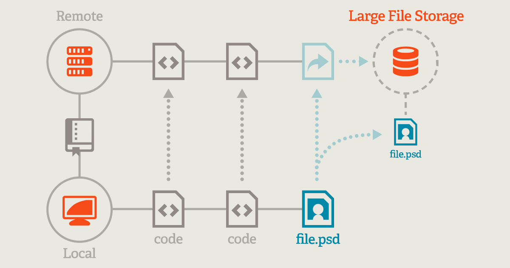

# auto_lfs (auto_lfs.sh)


_Created by **Ayoub Majjid** — [ayoub@majjid.com](mailto:ayoub@majjid.com) — [majjid.com](https://majjid.com)_

Automatic Git LFS tracking for large files in a repository.

This repository contains a simple utility script, `auto_lfs.sh`, that scans a target directory (a Git checkout or any directory) for files larger than a configurable threshold (default: 100 MB) and updates `.gitattributes` to track those files via Git LFS. It optionally attempts to run `git lfs track` for detected files if the target directory is versioned with Git.

---

Table of contents
- Overview
- What is Git LFS?
- Features
- Prerequisites
- Installation (short)
- Usage & Examples
- How it works
- Customization / Configuration
- Troubleshooting
- Contributing
- License

---

## Overview

Large binary files in Git repositories can cause repositories to grow quickly, slowing down clones and increasing the size of history. Git LFS (Large File Storage) keeps large file contents in a separate store and replaces them with lightweight pointers in the repository history. `auto_lfs.sh` scans directories and updates `.gitattributes` with paths to large files (tracked using Git LFS by adding entries such as `path filter=lfs diff=lfs merge=lfs -text`).

This script is intentionally lightweight, portable, and easy to improve—contributions are welcome.

## What is Git LFS?


Git LFS (Large File Storage) is an extension to Git that replaces large files in your repository with text pointers while storing the actual content on a separate server. This reduces repository size and improves clone and fetch performance.

- Official docs: https://git-lfs.github.com/
- Basic commands:
	- `git lfs install` — install LFS hooks and initial configuration
	- `git lfs track <path>` — add a path pattern to .gitattributes
	- `git lfs untrack <path>` — remove a pattern from .gitattributes

## Features

- Scans a directory for files larger than a default threshold (100 MB).
- Ignores `.git` directories during scanning.
- Adds missing file paths to `.gitattributes` using standard LFS attributes.
- Calls `git lfs track` to register tracked files if the directory is inside a Git repository.
- Uses `python` to compute relative paths robustly.

## Prerequisites

- Git (https://git-scm.com/)
- Git LFS (https://git-lfs.github.com/)
- Bash (the script is a Bash script and will run from macOS and Linux or WSL/Git Bash on Windows)
- Python 3.x (used for computing relative paths reliably)

Windows notes:
- The script is a bash script. On Windows, run via Git Bash (installed with Git for Windows) or WSL (Windows Subsystem for Linux). If you prefer to run a pure PowerShell or Batch script, a port is recommended.

## Installation (short)

1. Clone the repository:

```bash
git clone https://github.com/ayoubmajid67/auto_lfs.git
cd auto_lfs
```

2. Make the script executable (Linux/macOS):

```bash
chmod +x auto_lfs.sh
```

3. Ensure the prerequisites are installed.

### Installing Git LFS
- On macOS (Homebrew):

```bash
brew install git-lfs
git lfs install
```

- On Debian/Ubuntu:

```bash
sudo apt-get update
sudo apt-get install git-lfs
git lfs install
```

- On Windows:
	- Use the Git for Windows installer (https://git-scm.com/download/win), and enable Git LFS during installation or run the Git LFS installer separately.
	- After installation, run `git lfs install` using Git Bash or WSL.

## Usage

Run the script with a target directory or omit the directory to scan the current working directory.

```bash
# Scan the current directory
./auto_lfs.sh

# Scan a path
./auto_lfs.sh /path/to/repo
```

What the script does:

- Scans for files larger than `SIZE_LIMIT` (default set inside the script as `100M`).
- Creates `.gitattributes` if it doesn't exist in the target directory.
- Appends matching file path patterns to `.gitattributes` using `filter=lfs diff=lfs merge=lfs -text`.
- Tries to run `git lfs track` while inside the target directory so tracked patterns are also recorded by Git LFS.

Sample run:

```bash
$ ./auto_lfs.sh ~/projects/my-repo
🔍 Scanning '/home/you/projects/my-repo' for files larger than 100M (ignoring .git)...
📂 Updating .gitattributes in: /home/you/projects/my-repo/.gitattributes
➕ Adding: path/to/large_binary.bin
✔️  Done. Please review `.gitattributes` and commit the changes.
```

### Commit LFS changes (if you're in a Git repo):

```bash
cd /path/to/repo
git add .gitattributes
git add .
git commit -m "Track large files with Git LFS"
git push
```

Note: Running `git add .` will add the large file itself. If you already have history with large files, converting them to LFS requires migration steps (see https://github.com/git-lfs/git-lfs/wiki/Tips-and-Tricks#migrating-existing-history).

### Make `auto_lfs` available everywhere (alias & git alias)

If you want to run `auto_lfs` from anywhere on your system, you can either add an alias to your shell, add the script to your PATH, create a symlink into a location already on your PATH, or create a Git alias.

1) Shell alias (recommended for simple local setups — works for macOS, Linux, WSL, Git Bash):

```bash
# open the git bash : 
# Add the following to ~/.bashrc 
alias auto_lfs='bash "/absolute/path/to/auto_lfs.sh"'

# Example (WSL/GitBash): nano ~/.bashrc
alias auto_lfs='bash "/home/you/workspace/auto_lfs/auto_lfs.sh"'

#  press ctrl+ o then ctrl +x

# Then reload your shell config
source ~/.bashrc   # or ~/.zshrc

# Test : current path by default 
auto_lfs [/path/to/repo]
```

Notes:
- Use an absolute path in the alias so it works no matter the working directory.
- For paths containing single quotes (e.g., `l'Ingénieur`) use proper escaping:

```bash
alias auto_lfs='bash "/c/Users/ayoub/OneDrive - Ecole Marocaine des Sciences de l'\''Ingénieur/scripts/auto_lfs.sh"'
```


4) Git alias (run via `git` subcommand):

You can add a git alias that runs the script for convenience, then call it with `git auto-lfs`:

```bash
git config --global alias.auto-lfs '!bash /absolute/path/to/auto_lfs/auto_lfs.sh'

# Example usage
git auto-lfs /path/to/repo
```

Notes:
- The `!` prefix tells Git to execute the following command in a shell.
- Use the absolute path and proper quoting if the path contains spaces or special characters.

If you'd like, I can provide a small helper `install.sh` script that automates one of these setups (for example, creating a symlink in `/usr/local/bin` or writing a Git alias).

## How it works (script walk-through)

Key steps in `auto_lfs.sh`:

- The script sets a `SIZE_LIMIT` value, default `100M`.
- It detects the target directory from the first CLI argument or defaults to the current working directory.
- It creates `TARGET_DIR/.gitattributes` if it does not exist.
- It uses `find` to recursively search for files larger than `SIZE_LIMIT`, skipping `.git` directories.
- For each large file, the script computes a relative path with a small Python command that normalizes path separators for cross-platform consistency:

```bash
relative_path=$(python -c "import os,sys; print(os.path.relpath(sys.argv[1], sys.argv[2]).replace(os.sep, '/'))" "$file" "$TARGET_DIR")
```

- It checks whether the path already exists in `.gitattributes`. If not, it appends a line like:

```
path/to/file filter=lfs diff=lfs merge=lfs -text
```

- If the target directory is a Git repository, it runs `git lfs track <relative_path>` from the target directory to ensure Git LFS registers the pattern.

## Customization & Configuration

- Modify `SIZE_LIMIT` at the top of `auto_lfs.sh` to change the file size limit. Examples: `50M`, `100M`, `1G`.
- If you want to automatically run `git add` and commit the changes, you can extend the script to do so. The current behavior is intentionally non-destructive—changes are appended to `.gitattributes` and the script asks the user to review and commit.
- To make the script safer, consider adding a `--dry-run` flag (feature suggestion) that shows what would be changed without writing anything.

## Troubleshooting

- If you see: `Directory not found` — ensure you passed a correct path or run from the directory you want to scan.
- If Git LFS commands don't run on Windows: Run the script from Git Bash or WSL. Confirm `git` and `git lfs` are available in the environment (try `git lfs version`).
- If a file remains large in the Git history after adding `.gitattributes`: You must migrate existing Git history to LFS using migration tools (e.g., `git lfs migrate import --include=<path>`). This will rewrite Git history.

### Can't push because of already-committed large files?

If you've already committed large files and then discover you can't push (for example, the remote rejects the push because the object is too large), one practical workaround is to clone a fresh copy of the repository, add LFS tracking for the problematic files, and re-commit so the server will accept the objects. Note: this is a workaround and does not rewrite history. If you need to convert old commits, see the migration notes below.

Quick steps (workaround):

1. Ensure Git LFS is installed and enabled:

```bash
git lfs install
```

2. Clone a fresh copy of the repository (or a new branch):

```bash
git clone https://github.com/your-org/your-repo.git repo-copy
cd repo-copy
```

3. Run the `auto_lfs.sh` script to add entries to `.gitattributes` and register them with Git LFS:

```bash
~/path/to/auto_lfs.sh .
# or if auto_lfs is on your PATH
auto_lfs .
```

4. Review the generated `.gitattributes` and ensure it's correct:

```bash
cat .gitattributes
```

5. If the large files are already present in the working tree, remove them from the index and re-add so they become LFS-managed (do this per-path):

```bash
git rm --cached path/to/large-file.bin
git add path/to/large-file.bin
```

6. Commit and push the changes:

```bash
git add .gitattributes
git commit -m "Track large files with Git LFS"
git push
```

If the remote still rejects objects, it likely means the file is present in older commits in history — the right fix is to migrate the history or replace/remove the large objects from old commits. See the migration section below for a safer, more complete path.

Migration (rewrite history) — caution:

- `git lfs migrate import --include="<path>" --everything` will rewrite commits and replace the file references with LFS pointers across history. This is a destructive operation for the shared history and should be coordinated with other contributors. Use it only if you're comfortable rewriting history.

Example migration command:

```bash
git lfs migrate import --include="path/to/large-file.bin" --include-ref=refs/heads/main
```

After any history rewrite:
- Inform teammates and coordinate (they might need to re-clone).
- Force-push the rewritten branch (only when you understand consequences):

```bash
git push --force-with-lease
```

If you're unsure, prefer the reclone-and-track workaround or contact your Git hosting provider for allowed alternatives.

## Notes & Caveats

- The script uses `python` to calculate relative paths. Ensure Python 3 is available in the environment the script runs in.
- Running `git add .` after adding to `.gitattributes` is a separate step. The script avoids making commits automatically.
- Converting files already committed to Git into LFS requires history rewriting—be careful if collaborating with others on the same repository.

## Examples

Scan a repo and record changes:

```bash
./auto_lfs.sh /home/you/projects/my-repo
cd /home/you/projects/my-repo
git status
git add .gitattributes
git add <paths> # as required
git commit -m "Track large files with Git LFS"
git push
```

Alias example (portable, for Git Bash with paths that contain quotes and spaces):

```bash
# The existing README recommended an alias that used single quotes, which fails when paths include a single quote.
# A safer approach: use double quotes around the alias expansion; escape single quotes inside it.
alias auto_lfs='bash "/c/Users/ayoub/OneDrive - Ecole Marocaine des Sciences de l'\''Ingénieur/scripts/auto_lfs.sh"'

# For WSL users, you can use a shell alias in ~/.bashrc:
alias auto_lfs='bash ~/workspace/auto_lfs/auto_lfs.sh'
```

## Suggestions for improvements (Contributions welcome!)

- Add CLI flags for `--size-limit`, `--dry-run`, `--recursive`, `--extensions` (only target some file extensions), and `--commit`.
- Support JSON or YAML output to pipeline the results.
- Provide a Windows-native PowerShell script variant.
- Add a `--fix-history` guided workflow that uses `git lfs migrate` with safety checks and backing up a branch reference.
- Add automated tests for pattern detection and `.gitattributes` writing.

## Contributing

Contributions are warmly welcome. Here's how to help:

1. Fork the repo and create a feature branch.
2. Implement the change, add tests where appropriate.
3. Run the script manually and verify it behaves as expected.
4. Open a pull request describing the change, the rationale, and how to test it.

Please follow best practices (clear commit messages, small PRs, and tests if applicable).

## License

This repo includes a `LICENSE` file. Use the license terms in the file.
